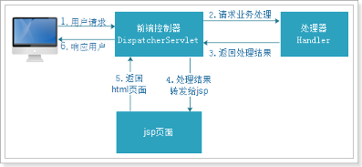

- [SpringMVC](#springmvc)
  - [Springmvc处理流程](#springmvc处理流程)
  - [入门程序](#入门程序)
    - [创建web工程](#创建web工程)
    - [导入jar包](#导入jar包)
    - [创建springmvc.xml](#创建springmvcxml)
    - [配置前段控制器](#配置前段控制器)
    - [加入jsp页面](#加入jsp页面)
    - [创建商品pojo](#创建商品pojo)
    - [创建ItemController](#创建itemcontroller)
    - [运行测试](#运行测试)
  - [SpringMVC架构](#springmvc架构)
    - [架构结构](#架构结构)
    - [组件说明](#组件说明)
  - [SpringMVC整合Mybatis](#springmvc整合mybatis)
  - [参数绑定](#参数绑定)
    - [springmvc 默认支持的类型](#springmvc-默认支持的类型)
    - [简单数据类型](#简单数据类型)
    - [pojo类型](#pojo类型)
    - [pojo包装类型](#pojo包装类型)
    - [自定义参数类型](#自定义参数类型)
  - [SpringMVC和Struts2的区别](#springmvc和struts2的区别)
  - [高级参数绑定](#高级参数绑定)
  - [@RequestMapping注解使用](#requestmapping注解使用)
  - [controller返回值](#controller返回值)
  - [springmvc异常处理](#springmvc异常处理)
  - [图片上传处理](#图片上传处理)
  - [json数据交互](#json数据交互)
  - [Springmvc 实现restfull](#springmvc-实现restfull)
  - [拦截器](#拦截器)

# SpringMVC

Spring web mvc和Struts2都属于表现层的框架,它是Spring框架的一部分,我们可以从Spring的整体结构中看得出来,如下图：


## Springmvc处理流程




## 入门程序

需求：使用浏览器显示商品列表

### 创建web工程

springMVC是表现层框架，需要搭建web工程开发。

环境 
```xml
Tomcat 7
Dynamic web moudle 的版本是2.5，可以自动生成web.xml配置文件，
```
### 导入jar包

复制jar到lib目录，工程直接加载jar包，如下图：


### 创建springmvc.xml

创建SpringMVC的核心配置文件
SpringMVC本身就是Spring的子项目，对Spring兼容性很好，不需要做很多配置。
这里只配置一个Controller扫描就可以了，让Spring对页面控制层Controller进行管理。

```xml
<?xml version="1.0" encoding="UTF-8"?>
<beans xmlns="http://www.springframework.org/schema/beans"
	xmlns:xsi="http://www.w3.org/2001/XMLSchema-instance" xmlns:p="http://www.springframework.org/schema/p"
	xmlns:context="http://www.springframework.org/schema/context"
	xmlns:mvc="http://www.springframework.org/schema/mvc"
	xsi:schemaLocation="http://www.springframework.org/schema/beans http://www.springframework.org/schema/beans/spring-beans-4.0.xsd
        http://www.springframework.org/schema/mvc http://www.springframework.org/schema/mvc/spring-mvc-4.0.xsd
        http://www.springframework.org/schema/context http://www.springframework.org/schema/context/spring-context-4.0.xsd">

	<!-- 配置controller扫描包 -->
	<context:component-scan base-package="cn.itcast.springmvc.controller" />

</beans>

```

配置文件约束如下：


### 配置前段控制器
配置SpringMVC的前端控制器DispatcherServlet
在web.xml中

```xml
<?xml version="1.0" encoding="UTF-8"?>
<web-app xmlns:xsi="http://www.w3.org/2001/XMLSchema-instance"
	xmlns="http://java.sun.com/xml/ns/javaee"
	xsi:schemaLocation="http://java.sun.com/xml/ns/javaee http://java.sun.com/xml/ns/javaee/web-app_2_5.xsd"
	id="WebApp_ID" version="2.5">
	<display-name>springmvc-first</display-name>
	<welcome-file-list>
		<welcome-file>index.html</welcome-file>
		<welcome-file>index.htm</welcome-file>
		<welcome-file>index.jsp</welcome-file>
		<welcome-file>default.html</welcome-file>
		<welcome-file>default.htm</welcome-file>
		<welcome-file>default.jsp</welcome-file>
	</welcome-file-list>

	<!-- 配置SpringMVC前端控制器 -->
	<servlet>
		<servlet-name>springmvc-first</servlet-name>
		<servlet-class>org.springframework.web.servlet.DispatcherServlet</servlet-class>
		<!-- 指定SpringMVC配置文件 -->
		<!-- SpringMVC的配置文件的默认路径是/WEB-INF/${servlet-name}-servlet.xml -->
		<init-param>
			<param-name>contextConfigLocation</param-name>
			<param-value>classpath:springmvc.xml</param-value>
		</init-param>
	</servlet>

	<servlet-mapping>
		<servlet-name>springmvc-first</servlet-name>
		<!-- 设置所有以action结尾的请求进入SpringMVC -->
		<url-pattern>*.action</url-pattern>
	</servlet-mapping>
</web-app>

```

### 加入jsp页面


添加 itemList.jsp到WEB-INF.

```jsp
<%@ page language="java" contentType="text/html; charset=UTF-8"
    pageEncoding="UTF-8"%>
<%@ taglib uri="http://java.sun.com/jsp/jstl/core" prefix="c" %>
<%@ taglib uri="http://java.sun.com/jsp/jstl/fmt"  prefix="fmt"%>
<!DOCTYPE html PUBLIC "-//W3C//DTD HTML 4.01 Transitional//EN" "http://www.w3.org/TR/html4/loose.dtd">
<html>
<head>
<meta http-equiv="Content-Type" content="text/html; charset=UTF-8">
<title>查询商品列表</title>
</head>
<body> 
<form action="${pageContext.request.contextPath }/item/queryitem.action" method="post">
查询条件：
<table width="100%" border=1>
<tr>
<td><input type="submit" value="查询"/></td>
</tr>
</table>
商品列表：
<table width="100%" border=1>
<tr>
	<td>商品名称</td>
	<td>商品价格</td>
	<td>生产日期</td>
	<td>商品描述</td>
	<td>操作</td>
</tr>
<c:forEach items="${itemList }" var="item">
<tr>
	<td>${item.name }</td>
	<td>${item.price }</td>
	<td><fmt:formatDate value="${item.createtime}" pattern="yyyy-MM-dd HH:mm:ss"/></td>
	<td>${item.detail }</td>
	
	<td><a href="${pageContext.request.contextPath }/itemEdit.action?id=${item.id}">修改</a></td>

</tr>
</c:forEach>

</table>
</form>
</body>

</html>
```

### 创建商品pojo

```java
public class Item {
	// 商品id
	private int id;
	// 商品名称
	private String name;
	// 商品价格
	private double price;
	// 商品创建时间
	private Date createtime;
	// 商品描述
	private String detail;

创建带参数的构造器
set/get。。。
}

```

### 创建ItemController

ItemController是一个普通的java类，不需要实现任何接口。
需要在类上添加@Controller注解，把Controller交由Spring管理
在方法上面添加@RequestMapping注解，里面指定请求的url。其中“.action”可以加也可以不加。

```java
@Controller
public class ItemController {

	// @RequestMapping：里面放的是请求的url，和用户请求的url进行匹配
	// action可以写也可以不写
	@RequestMapping("/itemList.action")
	public ModelAndView queryItemList() {
		// 创建页面需要显示的商品数据
		List<Item> list = new ArrayList<>();
		list.add(new Item(1, "1华为 荣耀8", 2399, new Date(), "质量好！1"));
		list.add(new Item(2, "2华为 荣耀8", 2399, new Date(), "质量好！2"));
		list.add(new Item(3, "3华为 荣耀8", 2399, new Date(), "质量好！3"));
		list.add(new Item(4, "4华为 荣耀8", 2399, new Date(), "质量好！4"));
		list.add(new Item(5, "5华为 荣耀8", 2399, new Date(), "质量好！5"));
		list.add(new Item(6, "6华为 荣耀8", 2399, new Date(), "质量好！6"));

		// 创建ModelAndView，用来存放数据和视图
		ModelAndView modelAndView = new ModelAndView();
		// 设置数据到模型中
		modelAndView.addObject("list", list);
		// 设置视图jsp，需要设置视图的物理地址
		modelAndView.setViewName("/WEB-INF/jsp/itemList.jsp");

		return modelAndView;
	}
}

```

### 运行测试

启动项目，浏览器访问地址
http://127.0.0.1:8080/springmvc-first/itemList.action

效果如下图：


## SpringMVC架构

### 架构结构

### 组件说明

## SpringMVC整合Mybatis

springmvc和spring是无缝整合(没有整合包)，spring和mybatis整合。这样就算三个整合完了。

## 参数绑定

### springmvc 默认支持的类型

### 简单数据类型

### pojo类型

### pojo包装类型

### 自定义参数类型

## SpringMVC和Struts2的区别


## 高级参数绑定

## @RequestMapping注解使用

## controller返回值

## springmvc异常处理

## 图片上传处理

## json数据交互

## Springmvc 实现restfull

## 拦截器


