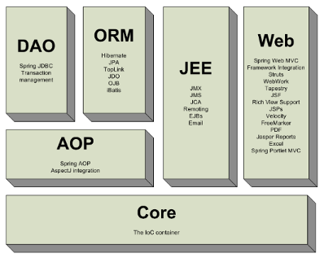
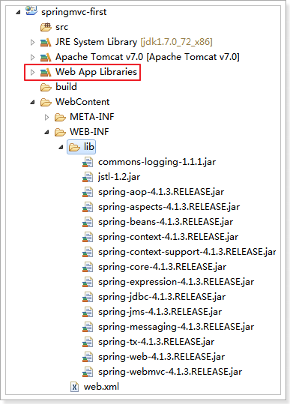
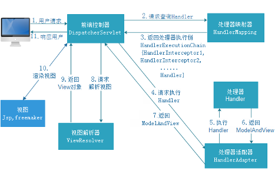

- [SpringMVC](#springmvc)
  - [Springmvc处理流程](#springmvc处理流程)
  - [入门程序](#入门程序)
    - [创建web工程](#创建web工程)
    - [导入jar包](#导入jar包)
    - [创建springmvc.xml](#创建springmvcxml)
    - [配置前段控制器](#配置前段控制器)
    - [加入jsp页面](#加入jsp页面)
    - [创建商品pojo](#创建商品pojo)
    - [创建ItemController](#创建itemcontroller)
    - [运行测试](#运行测试)
  - [SpringMVC架构](#springmvc架构)
    - [架构结构](#架构结构)
    - [组件说明](#组件说明)
      - [DispatcherServlet：前端控制器](#dispatcherservlet前端控制器)
      - [HandlerMapping：处理器映射器](#handlermapping处理器映射器)
      - [Handler：处理器](#handler处理器)
      - [HandlAdapter：处理器适配器](#handladapter处理器适配器)
      - [ViewResolver：视图解析器](#viewresolver视图解析器)
      - [View：视图](#view视图)
    - [spring默认加载的组件](#spring默认加载的组件)
    - [组件扫描](#组件扫描)
    - [注解映射器和适配器](#注解映射器和适配器)
      - [配置处理器映射器](#配置处理器映射器)
      - [配置处理器适配器](#配置处理器适配器)
      - [注解驱动](#注解驱动)
      - [视图解析器](#视图解析器)
      - [修改ItemController](#修改itemcontroller)
      - [效果](#效果)
  - [SpringMVC整合Mybatis](#springmvc整合mybatis)
    - [导入jar包](#导入jar包-1)
    - [整合思路](#整合思路)
    - [配置文件](#配置文件)
      - [sqlMapConfig.xml](#sqlmapconfigxml)
      - [applicationContext-dao.xml](#applicationcontext-daoxml)
      - [db.properties](#dbproperties)
      - [applicationContext-service.xml](#applicationcontext-servicexml)
      - [applicationContext-trans.xml](#applicationcontext-transxml)
      - [springmvc.xml](#springmvcxml)
      - [web.xml](#webxml)
      - [itemList.jsp和itemEdit.jsp到工程中](#itemlistjsp和itemeditjsp到工程中)
  - [参数绑定](#参数绑定)
    - [springmvc 默认支持的类型](#springmvc-默认支持的类型)
    - [简单数据类型](#简单数据类型)
    - [pojo类型](#pojo类型)
    - [pojo包装类型](#pojo包装类型)
    - [自定义参数类型](#自定义参数类型)
  - [SpringMVC和Struts2的区别](#springmvc和struts2的区别)
  - [高级参数绑定](#高级参数绑定)
  - [@RequestMapping注解使用](#requestmapping注解使用)
  - [controller返回值](#controller返回值)
  - [springmvc异常处理](#springmvc异常处理)
  - [图片上传处理](#图片上传处理)
  - [json数据交互](#json数据交互)
  - [Springmvc 实现restfull](#springmvc-实现restfull)
  - [拦截器](#拦截器)

# SpringMVC

Spring web mvc和Struts2都属于表现层的框架,它是Spring框架的一部分,我们可以从Spring的整体结构中看得出来,如下图：



## Springmvc处理流程


## 入门程序

需求：使用浏览器显示商品列表

### 创建web工程

springMVC是表现层框架，需要搭建web工程开发。

环境 
```xml
Tomcat 7
Dynamic web moudle 的版本是2.5，可以自动生成web.xml配置文件，
```
### 导入jar包

复制jar到lib目录，工程直接加载jar包，如下图：


### 创建springmvc.xml

创建SpringMVC的核心配置文件
SpringMVC本身就是Spring的子项目，对Spring兼容性很好，不需要做很多配置。
这里只配置一个Controller扫描就可以了，让Spring对页面控制层Controller进行管理。

```xml
<?xml version="1.0" encoding="UTF-8"?>
<beans xmlns="http://www.springframework.org/schema/beans"
	xmlns:xsi="http://www.w3.org/2001/XMLSchema-instance" xmlns:p="http://www.springframework.org/schema/p"
	xmlns:context="http://www.springframework.org/schema/context"
	xmlns:mvc="http://www.springframework.org/schema/mvc"
	xsi:schemaLocation="http://www.springframework.org/schema/beans http://www.springframework.org/schema/beans/spring-beans-4.0.xsd
        http://www.springframework.org/schema/mvc http://www.springframework.org/schema/mvc/spring-mvc-4.0.xsd
        http://www.springframework.org/schema/context http://www.springframework.org/schema/context/spring-context-4.0.xsd">

	<!-- 配置controller扫描包 -->
	<context:component-scan base-package="cn.itcast.springmvc.controller" />

</beans>

```

配置文件约束如下：


### 配置前段控制器
配置SpringMVC的前端控制器DispatcherServlet
在web.xml中

```xml
<?xml version="1.0" encoding="UTF-8"?>
<web-app xmlns:xsi="http://www.w3.org/2001/XMLSchema-instance"
	xmlns="http://java.sun.com/xml/ns/javaee"
	xsi:schemaLocation="http://java.sun.com/xml/ns/javaee http://java.sun.com/xml/ns/javaee/web-app_2_5.xsd"
	id="WebApp_ID" version="2.5">
	<display-name>springmvc-first</display-name>
	<welcome-file-list>
		<welcome-file>index.html</welcome-file>
		<welcome-file>index.htm</welcome-file>
		<welcome-file>index.jsp</welcome-file>
		<welcome-file>default.html</welcome-file>
		<welcome-file>default.htm</welcome-file>
		<welcome-file>default.jsp</welcome-file>
	</welcome-file-list>

	<!-- 配置SpringMVC前端控制器 -->
	<servlet>
		<servlet-name>springmvc-first</servlet-name>
		<servlet-class>org.springframework.web.servlet.DispatcherServlet</servlet-class>
		<!-- 指定SpringMVC配置文件 -->
		<!-- SpringMVC的配置文件的默认路径是/WEB-INF/${servlet-name}-servlet.xml -->
		<init-param>
			<param-name>contextConfigLocation</param-name>
			<param-value>classpath:springmvc.xml</param-value>
		</init-param>
	</servlet>

	<servlet-mapping>
		<servlet-name>springmvc-first</servlet-name>
		<!-- 设置所有以action结尾的请求进入SpringMVC -->
		<url-pattern>*.action</url-pattern>
	</servlet-mapping>
</web-app>

```

### 加入jsp页面


添加 itemList.jsp到WEB-INF.

```jsp
<%@ page language="java" contentType="text/html; charset=UTF-8"
    pageEncoding="UTF-8"%>
<%@ taglib uri="http://java.sun.com/jsp/jstl/core" prefix="c" %>
<%@ taglib uri="http://java.sun.com/jsp/jstl/fmt"  prefix="fmt"%>
<!DOCTYPE html PUBLIC "-//W3C//DTD HTML 4.01 Transitional//EN" "http://www.w3.org/TR/html4/loose.dtd">
<html>
<head>
<meta http-equiv="Content-Type" content="text/html; charset=UTF-8">
<title>查询商品列表</title>
</head>
<body> 
<form action="${pageContext.request.contextPath }/item/queryitem.action" method="post">
查询条件：
<table width="100%" border=1>
<tr>
<td><input type="submit" value="查询"/></td>
</tr>
</table>
商品列表：
<table width="100%" border=1>
<tr>
	<td>商品名称</td>
	<td>商品价格</td>
	<td>生产日期</td>
	<td>商品描述</td>
	<td>操作</td>
</tr>
<c:forEach items="${itemList }" var="item">
<tr>
	<td>${item.name }</td>
	<td>${item.price }</td>
	<td><fmt:formatDate value="${item.createtime}" pattern="yyyy-MM-dd HH:mm:ss"/></td>
	<td>${item.detail }</td>
	
	<td><a href="${pageContext.request.contextPath }/itemEdit.action?id=${item.id}">修改</a></td>

</tr>
</c:forEach>

</table>
</form>
</body>

</html>
```

### 创建商品pojo

```java
public class Item {
	// 商品id
	private int id;
	// 商品名称
	private String name;
	// 商品价格
	private double price;
	// 商品创建时间
	private Date createtime;
	// 商品描述
	private String detail;

创建带参数的构造器
set/get。。。
}

```

### 创建ItemController

ItemController是一个普通的java类，不需要实现任何接口。
需要在类上添加@Controller注解，把Controller交由Spring管理
在方法上面添加@RequestMapping注解，里面指定请求的url。其中“.action”可以加也可以不加。

```java
@Controller
public class ItemController {

	// @RequestMapping：里面放的是请求的url，和用户请求的url进行匹配
	// action可以写也可以不写
	@RequestMapping("/itemList.action")
	public ModelAndView queryItemList() {
		// 创建页面需要显示的商品数据
		List<Item> list = new ArrayList<>();
		list.add(new Item(1, "1华为 荣耀8", 2399, new Date(), "质量好！1"));
		list.add(new Item(2, "2华为 荣耀8", 2399, new Date(), "质量好！2"));
		list.add(new Item(3, "3华为 荣耀8", 2399, new Date(), "质量好！3"));
		list.add(new Item(4, "4华为 荣耀8", 2399, new Date(), "质量好！4"));
		list.add(new Item(5, "5华为 荣耀8", 2399, new Date(), "质量好！5"));
		list.add(new Item(6, "6华为 荣耀8", 2399, new Date(), "质量好！6"));

		// 创建ModelAndView，用来存放数据和视图
		ModelAndView modelAndView = new ModelAndView();
		// 设置数据到模型中
		modelAndView.addObject("list", list);
		// 设置视图jsp，需要设置视图的物理地址
		modelAndView.setViewName("/WEB-INF/jsp/itemList.jsp");

		return modelAndView;
	}
}

```

### 运行测试

启动项目，浏览器访问地址
http://127.0.0.1:8080/springmvc-first/itemList.action

效果如下图：


## SpringMVC架构

### 架构结构

框架结构如下图：



1.	用户发送请求至前端控制器DispatcherServlet
2.	DispatcherServlet收到请求调用HandlerMapping处理器映射器。
3.	处理器映射器根据请求url找到具体的处理器，生成处理器对象及处理器拦截器(如果有则生成)一并返回给DispatcherServlet。
4.	DispatcherServlet通过HandlerAdapter处理器适配器调用处理器
5.	执行处理器(Controller，也叫后端控制器)。
6.	Controller执行完成返回ModelAndView
7.	HandlerAdapter将controller执行结果ModelAndView返回给DispatcherServlet
8.	DispatcherServlet将ModelAndView传给ViewReslover视图解析器
9.	ViewReslover解析后返回具体View
10.	DispatcherServlet对View进行渲染视图（即将模型数据填充至视图中）。
11.	DispatcherServlet响应用户


### 组件说明

以下组件通常使用框架提供实现：
#### DispatcherServlet：前端控制器
用户请求到达前端控制器，它就相当于mvc模式中的c，dispatcherServlet是整个流程控制的中心，由它调用其它组件处理用户的请求，dispatcherServlet的存在降低了组件之间的耦合性。

#### HandlerMapping：处理器映射器
HandlerMapping负责根据用户请求url找到Handler即处理器，springmvc提供了不同的映射器实现不同的映射方式，例如：配置文件方式，实现接口方式，注解方式等。

#### Handler：处理器
Handler 是继DispatcherServlet前端控制器的后端控制器，在DispatcherServlet的控制下Handler对具体的用户请求进行处理。
由于Handler涉及到具体的用户业务请求，所以一般情况需要程序员根据业务需求开发Handler。

#### HandlAdapter：处理器适配器
通过HandlerAdapter对处理器进行执行，这是适配器模式的应用，通过扩展适配器可以对更多类型的处理器进行执行。
下图是许多不同的适配器，最终都可以使用usb接口连接


#### ViewResolver：视图解析器
View Resolver负责将处理结果生成View视图，View Resolver首先根据逻辑视图名解析成物理视图名即具体的页面地址，再生成View视图对象，最后对View进行渲染将处理结果通过页面展示给用户。 
#### View：视图
springmvc框架提供了很多的View视图类型的支持，包括：jstlView、freemarkerView、pdfView等。我们最常用的视图就是jsp。
一般情况下需要通过页面标签或页面模版技术将模型数据通过页面展示给用户，需要由程序员根据业务需求开发具体的页面。

>说明：在springmvc的各个组件中，处理器映射器、处理器适配器、视图解析器称为springmvc的三大组件。
需要用户开发的组件有handler、view

### spring默认加载的组件

我们没有做任何配置，就可以使用这些组件
因为框架已经默认加载这些组件了，配置文件位置如下图：

 

 ```xml
 # Default implementation classes for DispatcherServlet's strategy interfaces.
# Used as fallback when no matching beans are found in the DispatcherServlet context.
# Not meant to be customized by application developers.

org.springframework.web.servlet.LocaleResolver=org.springframework.web.servlet.i18n.AcceptHeaderLocaleResolver

org.springframework.web.servlet.ThemeResolver=org.springframework.web.servlet.theme.FixedThemeResolver

org.springframework.web.servlet.HandlerMapping=org.springframework.web.servlet.handler.BeanNameUrlHandlerMapping,\
	org.springframework.web.servlet.mvc.annotation.DefaultAnnotationHandlerMapping

org.springframework.web.servlet.HandlerAdapter=org.springframework.web.servlet.mvc.HttpRequestHandlerAdapter,\
	org.springframework.web.servlet.mvc.SimpleControllerHandlerAdapter,\
	org.springframework.web.servlet.mvc.annotation.AnnotationMethodHandlerAdapter

org.springframework.web.servlet.HandlerExceptionResolver=org.springframework.web.servlet.mvc.annotation.AnnotationMethodHandlerExceptionResolver,\
	org.springframework.web.servlet.mvc.annotation.ResponseStatusExceptionResolver,\
	org.springframework.web.servlet.mvc.support.DefaultHandlerExceptionResolver

org.springframework.web.servlet.RequestToViewNameTranslator=org.springframework.web.servlet.view.DefaultRequestToViewNameTranslator

org.springframework.web.servlet.ViewResolver=org.springframework.web.servlet.view.InternalResourceViewResolver

org.springframework.web.servlet.FlashMapManager=org.springframework.web.servlet.support.SessionFlashMapManager

 ```

 ### 组件扫描

 使用组件扫描器省去在spring容器配置每个Controller类的繁琐。
使用`<context:component-scan>`自动扫描标记@Controller的控制器类，
在springmvc.xml配置文件中配置如下：
```xml
<!-- 配置controller扫描包，多个包之间用,分隔 -->
<context:component-scan base-package="cn.itcast.springmvc.controller />
```

### 注解映射器和适配器

#### 配置处理器映射器

注解式处理器映射器，对类中标记了@ResquestMapping的方法进行映射。根据@ResquestMapping定义的url匹配@ResquestMapping标记的方法，匹配成功返回HandlerMethod对象给前端控制器。
HandlerMethod对象中封装url对应的方法Method。 

从spring3.1版本开始，废除了DefaultAnnotationHandlerMapping的使用，推荐使用RequestMappingHandlerMapping完成注解式处理器映射。

在springmvc.xml配置文件中配置如下：
```xml
<!-- 配置处理器映射器 -->
<bean
	class="org.springframework.web.servlet.mvc.method.annotation.RequestMappingHandlerMapping" />
```
注解描述：
@RequestMapping：定义请求url到处理器功能方法的映射

#### 配置处理器适配器

注解式处理器适配器，对标记@ResquestMapping的方法进行适配。

从spring3.1版本开始，废除了AnnotationMethodHandlerAdapter的使用，推荐使用RequestMappingHandlerAdapter完成注解式处理器适配。

在springmvc.xml配置文件中配置如下：
```xml
<!-- 配置处理器适配器 -->
<bean
	class="org.springframework.web.servlet.mvc.method.annotation.RequestMappingHandlerAdapter" />
```

#### 注解驱动

直接配置处理器映射器和处理器适配器比较麻烦，可以使用注解驱动来加载。
SpringMVC使用'<mvc:annotation-driven>'自动加载RequestMappingHandlerMapping和RequestMappingHandlerAdapter
可以在springmvc.xml配置文件中使用'<mvc:annotation-driven>'替代注解处理器和适配器的配置。
```xml
<!-- 注解驱动 -->
<mvc:annotation-driven />
```

#### 视图解析器

视图解析器使用SpringMVC框架默认的InternalResourceViewResolver，这个视图解析器支持JSP视图解析
在springmvc.xml配置文件中配置如下：
```xml
	<!-- Example: prefix="/WEB-INF/jsp/", suffix=".jsp", viewname="test" -> 
		"/WEB-INF/jsp/test.jsp" -->
	<!-- 配置视图解析器 -->
	<bean
		class="org.springframework.web.servlet.view.InternalResourceViewResolver">
		<!-- 配置逻辑视图的前缀 -->
		<property name="prefix" value="/WEB-INF/jsp/" />
		<!-- 配置逻辑视图的后缀 -->
		<property name="suffix" value=".jsp" />
	</bean>
```
逻辑视图名需要在controller中返回ModelAndView指定，比如逻辑视图名为ItemList，则最终返回的jsp视图地址:
“WEB-INF/jsp/itemList.jsp”

最终jsp物理地址：前缀+逻辑视图名+后缀

#### 修改ItemController
修改ItemController中设置视图的代码
```java
// @RequestMapping：里面放的是请求的url，和用户请求的url进行匹配
// action可以写也可以不写
@RequestMapping("/itemList.action")
public ModelAndView queryItemList() {
	// 创建页面需要显示的商品数据
	List<Item> list = new ArrayList<>();
	list.add(new Item(1, "1华为 荣耀8", 2399, new Date(), "质量好！1"));
	list.add(new Item(2, "2华为 荣耀8", 2399, new Date(), "质量好！2"));
	list.add(new Item(3, "3华为 荣耀8", 2399, new Date(), "质量好！3"));
	list.add(new Item(4, "4华为 荣耀8", 2399, new Date(), "质量好！4"));
	list.add(new Item(5, "5华为 荣耀8", 2399, new Date(), "质量好！5"));
	list.add(new Item(6, "6华为 荣耀8", 2399, new Date(), "质量好！6"));

	// 创建ModelAndView，用来存放数据和视图
	ModelAndView modelAndView = new ModelAndView();
	// 设置数据到模型中
	modelAndView.addObject("itemList", list);
	// 设置视图jsp，需要设置视图的物理地址
	// modelAndView.setViewName("/WEB-INF/jsp/itemList.jsp");
	// 配置好视图解析器前缀和后缀，这里只需要设置逻辑视图就可以了。
	// 视图解析器根据前缀+逻辑视图名+后缀拼接出来物理路径
	modelAndView.setViewName("itemList");

	return modelAndView;
}
```
#### 效果
效果和之前一样，如下图：


## SpringMVC整合Mybatis

springmvc和spring是无缝整合(没有整合包)，spring和mybatis整合。这样就算三个整合完了。

为了更好的学习 springmvc和mybatis整合开发的方法，需要将springmvc和mybatis进行整合。

整合目标：控制层采用springmvc、持久层使用mybatis实现。

### 导入jar包

1.	spring（包括springmvc）
2.	mybatis
3.	mybatis-spring整合包
4.	数据库驱动
5.	第三方连接池。


### 整合思路

Dao层：
1、SqlMapConfig.xml，空文件即可，但是需要文件头。
2、applicationContext-dao.xml
a)	数据库连接池
b)	SqlSessionFactory对象，需要spring和mybatis整合包下的。
c)	配置mapper文件扫描器。

Service层：
1、applicationContext-service.xml包扫描器，扫描@service注解的类。
2、applicationContext-trans.xml配置事务。

Controller层：
1、Springmvc.xml
a)	包扫描器，扫描@Controller注解的类。
b)	配置注解驱动
c)	配置视图解析器

Web.xml文件：
1、配置spring
2、配置前端控制器。

### 配置文件

创建资源文件夹config
在其下创建mybatis和spring文件夹，用来存放配置文件，如下图：


#### sqlMapConfig.xml
使用逆向工程来生成Mapper相关代码，不需要配置别名。
在config/mybatis下创建SqlMapConfig.xml
```xml
<?xml version="1.0" encoding="UTF-8"?>
<!DOCTYPE configuration
PUBLIC "-//mybatis.org//DTD Config 3.0//EN"
"http://mybatis.org/dtd/mybatis-3-config.dtd">
<configuration>

</configuration>
```

#### applicationContext-dao.xml
配置数据源、配置SqlSessionFactory、mapper扫描器。
```xml
<?xml version="1.0" encoding="UTF-8"?>
<beans xmlns="http://www.springframework.org/schema/beans"
	xmlns:context="http://www.springframework.org/schema/context" xmlns:p="http://www.springframework.org/schema/p"
	xmlns:aop="http://www.springframework.org/schema/aop" xmlns:tx="http://www.springframework.org/schema/tx"
	xmlns:xsi="http://www.w3.org/2001/XMLSchema-instance"
	xsi:schemaLocation="http://www.springframework.org/schema/beans http://www.springframework.org/schema/beans/spring-beans-4.0.xsd
	http://www.springframework.org/schema/context http://www.springframework.org/schema/context/spring-context-4.0.xsd
	http://www.springframework.org/schema/aop http://www.springframework.org/schema/aop/spring-aop-4.0.xsd http://www.springframework.org/schema/tx http://www.springframework.org/schema/tx/spring-tx-4.0.xsd
	http://www.springframework.org/schema/util http://www.springframework.org/schema/util/spring-util-4.0.xsd">

	<!-- 加载配置文件 -->
	<context:property-placeholder location="classpath:db.properties" />

	<!-- 数据库连接池 -->
	<bean id="dataSource" class="org.apache.commons.dbcp.BasicDataSource"
		destroy-method="close">
		<property name="driverClassName" value="${jdbc.driver}" />
		<property name="url" value="${jdbc.url}" />
		<property name="username" value="${jdbc.username}" />
		<property name="password" value="${jdbc.password}" />
		<property name="maxActive" value="10" />
		<property name="maxIdle" value="5" />
	</bean>

	<!-- 配置SqlSessionFactory -->
	<bean id="sqlSessionFactory" class="org.mybatis.spring.SqlSessionFactoryBean">
		<!-- 数据库连接池 -->
		<property name="dataSource" ref="dataSource" />
		<!-- 加载mybatis的全局配置文件 -->
		<property name="configLocation" value="classpath:mybatis/SqlMapConfig.xml" />
	</bean>

	<!-- 配置Mapper扫描 -->
	<bean class="org.mybatis.spring.mapper.MapperScannerConfigurer">
		<!-- 配置Mapper扫描包 -->
		<property name="basePackage" value="cn.itcast.ssm.mapper" />
	</bean>

</beans>
```
#### db.properties

配置数据库相关信息
```properties
jdbc.driver=com.mysql.jdbc.Driver
jdbc.url=jdbc:mysql://localhost:3306/springmvc?characterEncoding=utf-8
jdbc.username=root
jdbc.password=root
```
#### applicationContext-service.xml
```xml
<?xml version="1.0" encoding="UTF-8"?>
<beans xmlns="http://www.springframework.org/schema/beans"
	xmlns:context="http://www.springframework.org/schema/context" xmlns:p="http://www.springframework.org/schema/p"
	xmlns:aop="http://www.springframework.org/schema/aop" xmlns:tx="http://www.springframework.org/schema/tx"
	xmlns:xsi="http://www.w3.org/2001/XMLSchema-instance"
	xsi:schemaLocation="http://www.springframework.org/schema/beans http://www.springframework.org/schema/beans/spring-beans-4.0.xsd
	http://www.springframework.org/schema/context http://www.springframework.org/schema/context/spring-context-4.0.xsd
	http://www.springframework.org/schema/aop http://www.springframework.org/schema/aop/spring-aop-4.0.xsd http://www.springframework.org/schema/tx http://www.springframework.org/schema/tx/spring-tx-4.0.xsd
	http://www.springframework.org/schema/util http://www.springframework.org/schema/util/spring-util-4.0.xsd">

	<!-- 配置service扫描 -->
	<context:component-scan base-package="cn.itcast.ssm.service" />

</beans>
```

#### applicationContext-trans.xml
```xml
<?xml version="1.0" encoding="UTF-8"?>
<beans xmlns="http://www.springframework.org/schema/beans"
	xmlns:context="http://www.springframework.org/schema/context" xmlns:p="http://www.springframework.org/schema/p"
	xmlns:aop="http://www.springframework.org/schema/aop" xmlns:tx="http://www.springframework.org/schema/tx"
	xmlns:xsi="http://www.w3.org/2001/XMLSchema-instance"
	xsi:schemaLocation="http://www.springframework.org/schema/beans http://www.springframework.org/schema/beans/spring-beans-4.0.xsd
	http://www.springframework.org/schema/context http://www.springframework.org/schema/context/spring-context-4.0.xsd
	http://www.springframework.org/schema/aop http://www.springframework.org/schema/aop/spring-aop-4.0.xsd http://www.springframework.org/schema/tx http://www.springframework.org/schema/tx/spring-tx-4.0.xsd
	http://www.springframework.org/schema/util http://www.springframework.org/schema/util/spring-util-4.0.xsd">

	<!-- 事务管理器 -->
	<bean id="transactionManager"
		class="org.springframework.jdbc.datasource.DataSourceTransactionManager">
		<!-- 数据源 -->
		<property name="dataSource" ref="dataSource" />
	</bean>

	<!-- 通知 -->
	<tx:advice id="txAdvice" transaction-manager="transactionManager">
		<tx:attributes>
			<!-- 传播行为 -->
			<tx:method name="save*" propagation="REQUIRED" />
			<tx:method name="insert*" propagation="REQUIRED" />
			<tx:method name="delete*" propagation="REQUIRED" />
			<tx:method name="update*" propagation="REQUIRED" />
			<tx:method name="find*" propagation="SUPPORTS" read-only="true" />
			<tx:method name="get*" propagation="SUPPORTS" read-only="true" />
			<tx:method name="query*" propagation="SUPPORTS" read-only="true" />
		</tx:attributes>
	</tx:advice>

	<!-- 切面 -->
	<aop:config>
		<aop:advisor advice-ref="txAdvice"
			pointcut="execution(* cn.itcast.ssm.service.*.*(..))" />
	</aop:config>

</beans>
```

#### springmvc.xml

```xml
<?xml version="1.0" encoding="UTF-8"?>
<beans xmlns="http://www.springframework.org/schema/beans"
	xmlns:xsi="http://www.w3.org/2001/XMLSchema-instance" xmlns:p="http://www.springframework.org/schema/p"
	xmlns:context="http://www.springframework.org/schema/context"
	xmlns:mvc="http://www.springframework.org/schema/mvc"
	xsi:schemaLocation="http://www.springframework.org/schema/beans http://www.springframework.org/schema/beans/spring-beans-4.0.xsd
        http://www.springframework.org/schema/mvc http://www.springframework.org/schema/mvc/spring-mvc-4.0.xsd
        http://www.springframework.org/schema/context http://www.springframework.org/schema/context/spring-context-4.0.xsd">

	<!-- 配置controller扫描包 -->
	<context:component-scan base-package="cn.itcast.ssm.controller" />

	<!-- 注解驱动 -->
	<mvc:annotation-driven />

	<!-- Example: prefix="/WEB-INF/jsp/", suffix=".jsp", viewname="test" -> 
		"/WEB-INF/jsp/test.jsp" -->
	<!-- 配置视图解析器 -->
	<bean
	class="org.springframework.web.servlet.view.InternalResourceViewResolver">
		<!-- 配置逻辑视图的前缀 -->
		<property name="prefix" value="/WEB-INF/jsp/" />
		<!-- 配置逻辑视图的后缀 -->
		<property name="suffix" value=".jsp" />
	</bean>

</beans>
```
#### web.xml
```xml
<?xml version="1.0" encoding="UTF-8"?>
<web-app xmlns:xsi="http://www.w3.org/2001/XMLSchema-instance"
	xmlns="http://java.sun.com/xml/ns/javaee"
	xsi:schemaLocation="http://java.sun.com/xml/ns/javaee http://java.sun.com/xml/ns/javaee/web-app_2_5.xsd"
	id="WebApp_ID" version="2.5">
	<display-name>springmvc-web</display-name>
	<welcome-file-list>
		<welcome-file>index.html</welcome-file>
		<welcome-file>index.htm</welcome-file>
		<welcome-file>index.jsp</welcome-file>
		<welcome-file>default.html</welcome-file>
		<welcome-file>default.htm</welcome-file>
		<welcome-file>default.jsp</welcome-file>
	</welcome-file-list>

	<!-- 配置spring -->
	<context-param>
		<param-name>contextConfigLocation</param-name>
		<param-value>classpath:spring/applicationContext*.xml</param-value>
	</context-param>

	<!-- 使用监听器加载Spring配置文件 -->
	<listener>
		<listener-class>org.springframework.web.context.ContextLoaderListener</listener-class>
	</listener>

	<!-- 配置SrpingMVC的前端控制器 -->
	<servlet>
		<servlet-name>springmvc-web</servlet-name>
		<servlet-class>org.springframework.web.servlet.DispatcherServlet</servlet-class>
		<init-param>
			<param-name>contextConfigLocation</param-name>
			<param-value>classpath:spring/springmvc.xml</param-value>
		</init-param>
	</servlet>

	<servlet-mapping>
		<servlet-name>springmvc-web</servlet-name>
		<!-- 配置所有以action结尾的请求进入SpringMVC -->
		<url-pattern>*.action</url-pattern>
	</servlet-mapping>

</web-app>
```

#### itemList.jsp和itemEdit.jsp到工程中

[itemList.jsp](/heima/spring-mvc/01 SpringMvc基础/源码笔记/01.参考资料/案例/jsp/editItem.jsp)


## 参数绑定

### springmvc 默认支持的类型

### 简单数据类型

### pojo类型

### pojo包装类型

### 自定义参数类型

## SpringMVC和Struts2的区别


## 高级参数绑定

## @RequestMapping注解使用

## controller返回值

## springmvc异常处理

## 图片上传处理

## json数据交互

## Springmvc 实现restfull

## 拦截器


